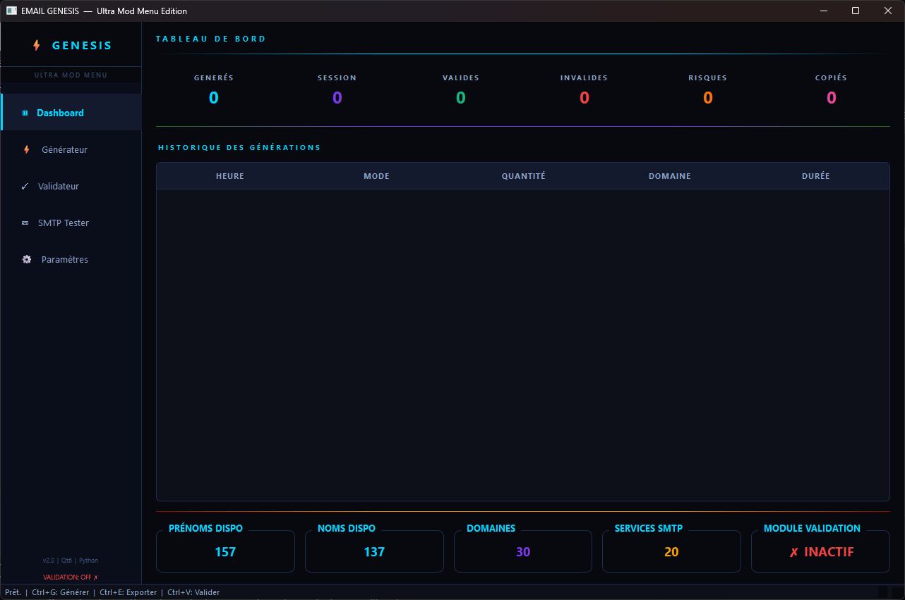
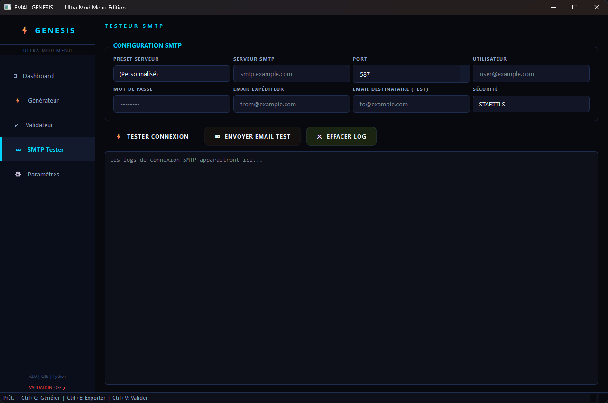

🚀 BillyGEN
BillyGEN est une suite logicielle avancée conçue pour la génération, la simulation et la validation d'identités numériques (emails). Doté d'une interface graphique PySide6 futuriste, il offre des outils puissants pour les développeurs, les testeurs d'intrusion et les administrateurs système.

  
  
  

  

  

✨ Fonctionnalités Principales
⚡ Générateur Intelligent
Modes prédéfinis : Perso (noms réels), Pro (domaines tech), et Simulation (avec headers).

Mode Custom : Créez vos propres patterns avec les variables {prenom}, {nom}, {num} et {domaine}.

Performance : Moteur multi-threadé capable de générer des milliers d'emails en quelques secondes sans figer l'interface.

🛡️ Checker SMTP & Validation (Nouveau)
BillyGEN ne se contente pas de générer des listes ; il permet de vérifier la validité réelle des adresses via un module de validation complet :

Vérification SMTP : Teste la connexion avec les serveurs de messagerie pour confirmer l'existence des boîtes aux lettres.

Analyse DNS/MX : Vérifie si le domaine possède des enregistrements MX valides pour recevoir des emails.

Détection "Disposable" : Identifie et filtre les emails jetables (temp-mail, etc.).

Correction de Syntaxe : Nettoie les listes des erreurs de frappe et formats invalides.

🎨 Interface "Mod Menu"
Thèmes Dynamiques : Changez l'ambiance entre Cyber Neon, Matrix, Crimson ou Gold.

Effets Visuels : Arrière-plan animé avec système de particules et grille néon.

Tableau de Bord : Statistiques détaillées avec compteurs animés et historique des sessions de génération/vérification.

🛠 Installation
Cloner le dépôt :

Bash
git clone https://github.com/billy770013/BillyGEN.git
cd BillyGEN
Installer les dépendances :

Bash
pip install PySide6
Configuration du Checker :
Pour utiliser les fonctions de validation SMTP et DNS, assurez-vous que le dossier email-validation-master est bien présent à la racine du projet.

🚀 Utilisation
Lancez l'application :

Bash
python smtp.py
Génération : Configurez la quantité et le mode, puis cliquez sur GÉNÉRER.

Validation : Passez à l'onglet Validation pour lancer le checker SMTP sur votre liste actuelle.

Filtrage : Utilisez l'option "No Dup" pour éliminer les doublons instantanément.

Export : Sauvegardez vos listes vérifiées d'un seul clic.

⚙️ Détails Techniques
Asynchronisme : Utilisation intensive des QThreads pour séparer la logique de calcul de l'interface graphique.

Nettoyage de données : Algorithme de normalisation Unicode pour traiter les caractères spéciaux et accents.

Rendu : Utilisation de QPainter pour les animations fluides à 60 FPS.
